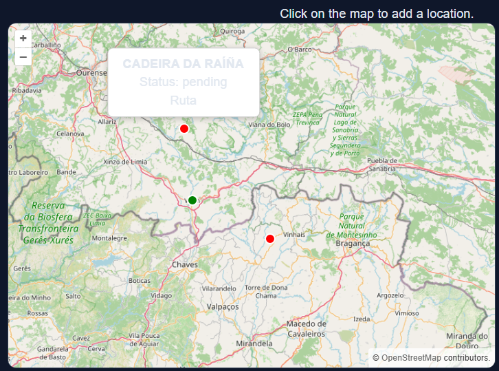
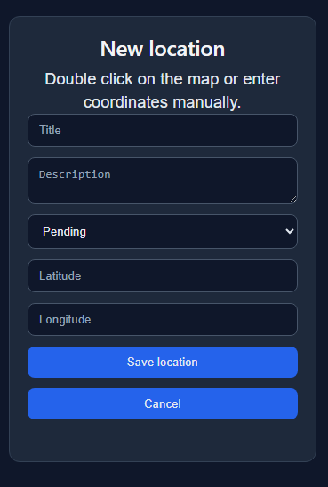
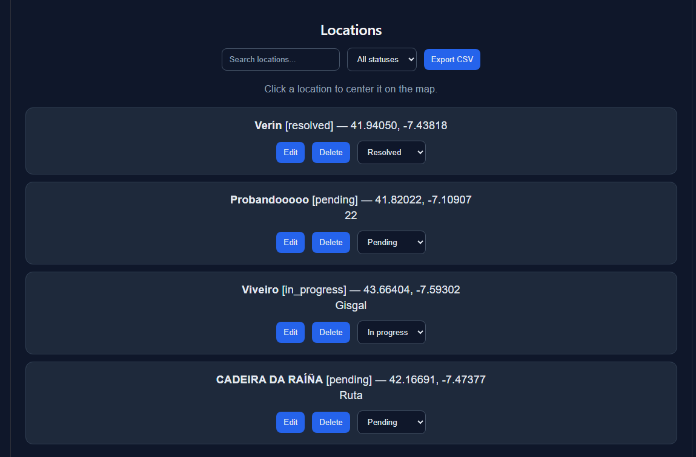

# GeoCheck

A fullstack geospatial incident management application built with React, Node.js, Express, PostgreSQL, PostGIS, OpenLayers and Docker.

The application allows users to create, manage, visualize and organize geolocated incidents through an interactive map connected to a REST API backend.

## What I Learned

Through this project I practiced:

* Building a fullstack geospatial application with React and Express
* Connecting a React frontend to a REST API
* Using fetch and asynchronous API calls
* Structuring a React application using reusable components
* Managing state with React hooks
* Creating CRUD operations between frontend and backend
* Working with PostgreSQL and PostGIS for spatial data management
* Creating and querying geospatial data
* Building and consuming REST API endpoints
* Managing environment variables
* Creating responsive user interfaces with CSS
* Integrating OpenLayers into a React application
* Working with map interactions and events
* Displaying markers and overlays on interactive maps
* Implementing location search, filtering and statistics
* Using localStorage to persist map preferences
* Improving frontend UX with conditional rendering and validations
* Structuring a fullstack project architecture
* Containerizing applications with Docker
* Using Docker Compose to orchestrate multiple services
* Running React, Express and PostgreSQL in containers
* Managing persistent database volumes with Docker

## Features

* Create, edit and delete locations
* Interactive map powered by OpenLayers
* PostgreSQL database persistence
* PostGIS spatial database integration
* React frontend connected to an Express backend
* Display locations as map markers
* Marker colors based on incident status
* Click locations to center the map automatically
* Map popups with location details
* Create locations directly from the map
* Create locations using manual coordinates
* Search locations by title
* Filter locations by status
* Dashboard statistics
* CSV export functionality
* Responsive dark-themed UI
* Form validation
* Delete confirmation dialogs
* Local storage persistence for map position and zoom

## Technologies Used

### Frontend

* React
* JavaScript
* CSS
* Vite
* OpenLayers

### Backend

* Node.js
* Express
* PostgreSQL
* PostGIS

### DevOps

* Docker
* Docker Compose

## Project Evolution

### Initial Version

* Express backend with PostgreSQL and PostGIS
* Basic CRUD operations
* React frontend connected to a REST API
* Interactive map with OpenLayers

### Current Version

* Added marker styling based on location status
* Added map popups with incident details
* Replaced prompt-based creation with a form interface
* Added location search and status filtering
* Added dashboard statistics
* Added CSV export functionality
* Added map navigation from the location list
* Persisted map center and zoom with localStorage
* Improved frontend UX with validations and notifications
* Dockerized PostgreSQL/PostGIS for local development

## How to Run

### Backend

Install dependencies:

```bash
cd backend
npm install
```

Create a `.env` file inside the backend folder:

```env
DB_HOST=localhost
DB_PORT=5432
DB_USER=postgres
DB_PASSWORD=postgres
DB_NAME=geo_check
PORT=3000
```

Run the backend server:

```bash
npm run dev
```

Backend URL:

```text
http://localhost:3000
```

### Frontend

Install dependencies:

```bash
cd frontend
npm install
```

Run the frontend server:

```bash
npm run dev
```

Frontend URL:

```text
http://localhost:5173
```

## Run with Docker

Build and start all services:

```bash
docker compose up --build
```

Stop services:

```bash
docker compose down
```

Services:

* Frontend: http://localhost:5173
* Backend: http://localhost:3000
* PostgreSQL/PostGIS: localhost:5432

The application runs with:

* React frontend
* Express backend
* PostgreSQL database with PostGIS

All services are orchestrated with Docker Compose.

## Screenshots

### Interactive Map



### Location Form



### Dashboard and Filters


